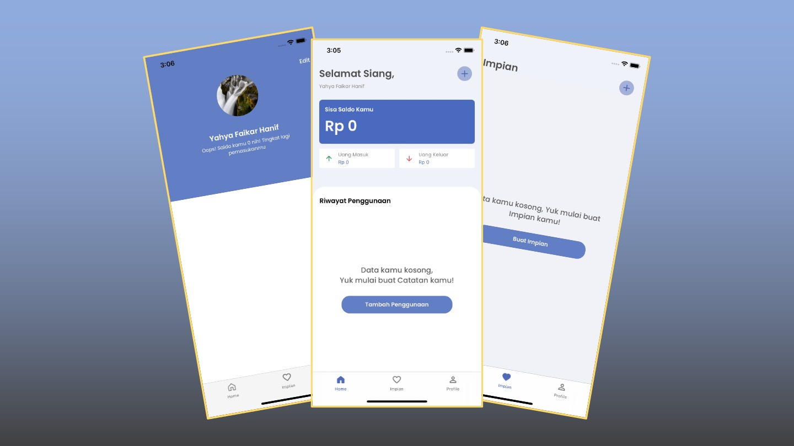
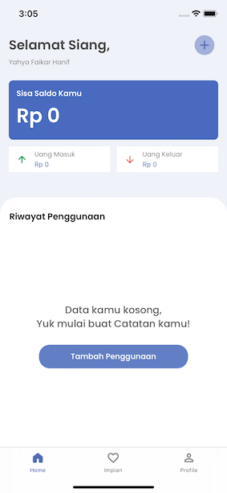
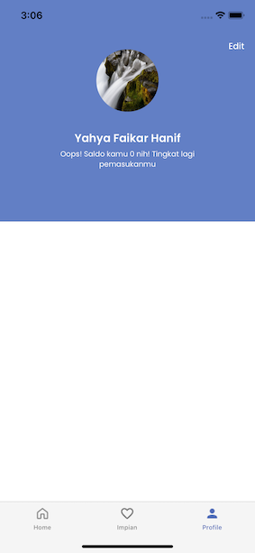
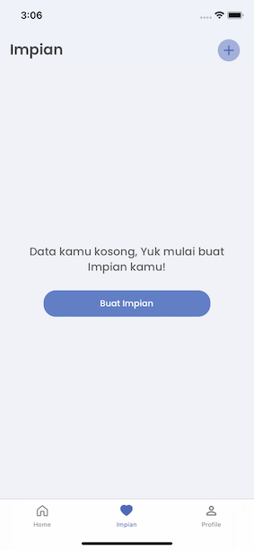

# <center> **MyMonee - Money Saver** </center>




### <center> _A money management application that ready accompanies you every day_ </center> 
_<center> by: Yahya Faikar Hanif </center>_

<br>

## **#About This Project**
My monee is a financial management application that is ready to accompany your days. This application was developed using swift and xcode technology as native tools to build iOS and other Apple apps and using the MVC Design Pattern.<br>

<br>

## **#Features**
- Daily transaction notes
- Dream list
- Balance
- Change name and photo profile

<br>

## **#Technology**
1. Swift 5 and Xcode 12.4 - A native way to build iOS and other Apple Platform
2. MVC Design Pattern - Basic way to build iOS app

<br>

## **#How To Run This App**
1. Make sure you have Mac or Other Apple Device that can run Xcode
2. Clone this repository to your local hard drive
```sh
https://github.com/yahyaf17/my-monee.git
``` 
3. In git, there are two version, with and without api. If you want to use api to persist your data, change the branch to final-project-api. Meanwhile the master branch didn't have the persistant feature 
4. Open the workspace file. 
5. Just run the app and ready to use

<br>

## **#App Screen**

### _Home Screen_


### _Profile Screen_


### _Dream Screen_

